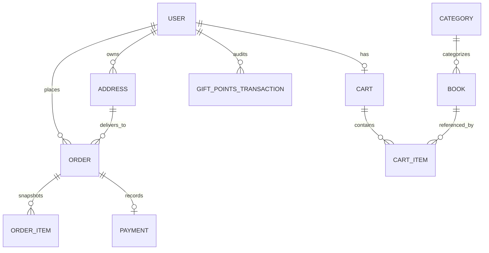

# E-Bookstore Capstone: Architecture, Wireframe Analysis & Test Specification

> **Document Version:** 2.0.0  
> **Source:** *AI Specialist - Cloud FullStack - Capstone instructions.pptx* (Slides 1–13)  
> **OpenAPI Reference:** `e-bookstore-openapi (1).yaml`  
> **Design Theme:** Floral Pastel Minimalism with Bold Purple Accents (*Hydrangea Palette*, Sharp Edges)  
> **Target Stack:** Spring Boot 3.3.4 (Java 17), Spring Security + JJWT, Spring Data JPA (H2 / PostgreSQL), Tailwind CSS

---

## Table of Contents

1. [Executive Summary](#1-executive-summary)
2. [End-to-End Customer Journey](#2-end-to-end-customer-journey)
3. [Wireframe Screen Specifications (Slides 5–10)](#3-wireframe-screen-specifications-slides-510)
4. [Data Architecture & Domain Model](#4-data-architecture--domain-model)
5. [Core Business Invariants & State Machines](#5-core-business-invariants--state-machines)
6. [Design System: Hydrangea Floral Pastel Minimalism](#6-design-system-hydrangea-floral-pastel-minimalism)
7. [API Test Specification & Traceability Matrix](#7-api-test-specification--traceability-matrix)
8. [End-to-End Integration Journey](#8-end-to-end-integration-journey)
9. [Build, Test & Run Guide](#9-build-test--run-guide)

---

## 1. Executive Summary

This specification unifies the functional, architectural, visual, and testing requirements for the **Book Worm** full-stack e-commerce bookstore capstone application.

The application enables customers to browse a curated catalogue of books across genres, inspect realistic 3D front-and-back paperback covers, manage an active cart, select shipping destinations, redeem accrued loyalty gift points, simulate payments with idempotency safeguards, and repurchase prior reads with a single click.

---

## 2. End-to-End Customer Journey

The 12 customer journey touchpoints derived from Slide 3 and Slides 5–10:


### Customer Touchpoint Matrix

| Step | Wireframe Screen | Primary User Action | Backend State Transition |
|---|---|---|---|
| **1** | Auth Modal (Slide 1/2) | 1-Click Demo Login (`demo@ebookstore.com`) | Authenticates JWT token; loads points balance (500 pts) |
| **2** | Catalogue Shelf (Slide 5) | View Bestsellers, Recommendations & New Launches | Fetches `/api/v1/books` and `/me/recommendations` |
| **3** | Filter Bar & Sidebar (Slide 6) | Filter by Category, Publisher, Format, Search | Dynamic query filtering with debounced search |
| **4** | Book Details (Slide 7) | Inspect 3D Front & Back Covers, Blurb & ISBN Barcode | Fetches `/api/v1/books/{id}` and `/related` |
| **5** | Add to Basket (Slide 7/8) | Click *Add to Basket* with selected quantity | Updates `/me/cart/items` with stock validation |
| **6** | Shopping Cart (Slide 8) | Select saved address or enter shipping address | Loads `/me/addresses` and sets delivery address |
| **7** | Grand Total Breakdown (Slide 8) | Enter points to redeem (1 pt = ₹1 discount) | Calculates quote: `subtotal - pointsRedeemed` |
| **8** | Order Placement (Slide 8) | Click *Pay Now* (generates Idempotency Key) | Creates Order in `PENDING_PAYMENT` state; reserves stock & points |
| **9** | Complete Payment (Slide 9) | Select payment tab (CC/DC/UPI/Wallet) and outcome | Calls `/me/orders/{id}/pay` with idempotency key |
| **10** | Purchase Confirmation (Slide 10) | View confirmation card & purchased book list | Order transitions to `PAID`; awards reward points |
| **11** | Order History (Slide 6/10) | Review previous orders & price snapshots | Lists orders ordered by `createdAt DESC` |
| **12** | Buy In Again (Slide 6) | Click *Buy In Again* on a past order | Re-adds available items to current cart at current prices |

---

## 3. Wireframe Screen Specifications (Slides 5–10)

### Slide 5 & 6: Home & Filtered Catalogue
* **Layout:** Top navigation bar (Logo, Browse, Orders, Wishlist, Gift Points pill, Cart counter, Profile), Left category sidebar, Top filter toolbar, and 3 content shelves.
* **Filter Toolbar:** Search input (debounced), Language dropdown (`All`, `English`, `Hindi`), Format dropdown (`Paperback`, `Hard Cover`, `eBook`), Publisher/Brand selector, and Sort selector (`Relevance`, `Price: Low to High`, `Price: High to Low`).
* **Content Shelves:**
  1. *Recommended for You* (Peach panel with Orchid pink badge, personalized based on order history).
  2. *Bestsellers this Month* (Main catalogue grid with split 3D book covers and neutral card containers).
  3. *New Launches* (Peach panel highlighting recently published titles).

### Slide 7: Product Details & Dual 3D Covers
* **Dual Cover Visual (Image 10):**
  * **Front Cover:** Best Seller Edition ribbon, Book Title, Emblem (`📖`), Author, and Left-hand realistic spine crease (`.book-spine-crease`).
  * **Back Cover:** Right-hand mirrored spine crease, italicized quote in soft peach accent, book blurb excerpt, dedicated *About the Author* section, publisher colophon badge, and authentic white *ISBN-13 Barcode card* with vector barcode lines and numbers (`ISBN 978-0-123456-78-9`).
* **Right Panel:** Breadcrumbs navigation, Book Title, Author, Publisher, Price (₹), Tentative delivery tag (`Delivery by Mon, 21 Jul`), In-Stock status badge, Primary CTA button (*Add to Basket*), and *Related Reads* shelf.
* **Lower Sections:** Social proof statistics (Language, Rating, Copies sold), Full synopsis, Author biography, and Customer review submission form.

### Slide 8: Shopping Cart & Delivery Checkout
* **Top Shelf:** Horizontal book cards showing cover, title, author, price, quantity controls (`-` / `+`), and remove button.
* **Left Column (3/5 width):** Delivery destination dropdown, Saved address toggle checkbox, and address input fields (First Name, Last Name, Street Address, City, State, Postal Code, Country).
* **Right Column (2/5 width - Peach Panel):**
  * Subtotal calculation (`price × quantity`).
  * Tax & Regulatory notice (`₹0.00`).
  * Free Delivery indicator.
  * Loyalty Gift Points redemption box (input, slider, balance indicator, *Apply* button).
  * Points discount line (`-₹XX.00`).
  * Grand Total amount.
  * Primary CTA button (*Pay Now* with security lock indicator).

### Slide 9: Complete Payment Modal
* **Modal Structure:** Sharp rectangular modal with peach header bar, displaying payable amount.
* **Left Column:** Vertical payment method tabs (*Credit Card*, *Debit Card*, *UPI*, *Wallet*).
* **Right Column:** Card details form (masked card number, cardholder name, CVV, expiry date).
* **Simulation Controller:** Evaluation selector (`APPROVED` vs `DECLINED`) allowing reviewers to test both approved and declined payment outcomes.
* **Actions:** *Cancel* and *Pay Now* (initiates idempotent payment).

### Slide 10: Purchase Confirmation & Order History
* **Confirmation Modal:** Hydrangea floral checkmark emblem, congratulatory heading, purchased books thumbnail gallery with quantities and prices, *Continue Shopping* button, and *View in My Orders* button.
* **Order History View:** Chronological list of orders with Order ID, purchase timestamp, status badge (`PAID`, `PAYMENT_FAILED`, `CANCELLED`), delivery address snapshot, unit price snapshot, points redeemed, and *Buy In Again* button.

---

## 4. Data Architecture & Domain Model

### Entity Relationship Model



### Entity Schema Summary

| Entity | Fields | Constraints & Invariants |
|---|---|---|
| **User** | `id`, `name`, `email`, `password`, `giftPointsBalance` | Unique email; gift points balance cannot be negative. |
| **Category** | `id`, `name` | Unique category name. |
| **Book** | `id`, `title`, `author`, `publisher`, `description`, `price`, `coverUrl`, `availableStock`, `category_id` | Stock must be $\ge 0$; price must be $> 0.00$. |
| **Cart** | `id`, `user_id`, `updatedAt` | One active cart per user. |
| **CartItem** | `id`, `cart_id`, `book_id`, `quantity` | Quantity $\ge 1$; quantity cannot exceed `availableStock`. |
| **Address** | `id`, `user_id`, `recipient`, `line1`, `line2`, `city`, `state`, `postalCode` | Belongs to a single user. Mandatory street, city, state, PIN. |
| **Order** | `id`, `user_id`, `address_id`, `subtotal`, `pointsRedeemed`, `finalTotal`, `status`, `createdAt`, `idempotencyKey` | Status enum: `PENDING_PAYMENT`, `PAID`, `PAYMENT_FAILED`, `CANCELLED`, `SHIPPED`. |
| **OrderItem** | `id`, `order_id`, `book_id`, `title`, `unitPrice`, `quantity` | Preserves purchase-time unit price and title snapshots. |
| **Payment** | `id`, `order_id`, `method`, `amount`, `status`, `transactionReference`, `createdAt` | Method enum: `CREDIT_CARD`, `DEBIT_CARD`, `UPI`, `WALLET`. Status: `APPROVED`, `DECLINED`. |
| **GiftPointsTransaction** | `id`, `user_id`, `order_id`, `pointsDelta`, `createdAt` | Positive delta for refunds/awards, negative for redemptions. |

---

## 5. Core Business Invariants & State Machines

### 1. Order Lifecycle & Transitions
* `PENDING_PAYMENT`: Initial state upon checkout. Stock and gift points are temporarily reserved.
* `PAID`: Payment approved. Stock deduction finalized. Reward points awarded (1% of order value).
* `PAYMENT_FAILED`: Payment simulation declined. Reserved points are restored immediately.
* `CANCELLED`: Order cancelled within 48 hours (Slide 3 #12). Reserved points and book inventory are restored.
* `SHIPPED`: Order dispatched. Terminal state; cannot be cancelled.

### 2. Idempotency Invariants
* All order creation (`POST /me/orders`) and payment (`POST /me/orders/{id}/pay`) requests require an `Idempotency-Key` header (UUID format).
* **Same key + same request payload:** Returns the existing saved response without re-processing (no double charges, no duplicate orders).
* **Same key + altered request payload:** Returns `409 Conflict`.
* **Missing key:** Returns `400 Bad Request`.

### 3. Pricing & Points Redemption Invariants
* **Point Conversion:** $1\text{ Gift Point} = ₹1.00\text{ discount}$.
* **Bounds:** $\text{Points Redeemed} \le \min(\text{User Balance}, \lfloor\text{Cart Subtotal}\rfloor)$.
* **Price Snapshots:** Order items freeze the exact title and unit price at time of purchase. Future changes in catalogue prices never alter historic order totals.

### 4. Buy Again Mechanics
* Reads books from a previous order and attempts to add them to the customer's active cart.
* Uses **current catalogue prices** and verifies that `availableStock > 0`.
* Out-of-stock items are omitted or flagged without corrupting the cart.

---

## 6. Design System: Hydrangea Floral Pastel Minimalism

The visual presentation adheres to the **“Hydrangea” color palette** with sharp geometric edges:

| Token | Hex | UI Role |
|---|---|---|
| **Page Canvas** | `#FAF8F5` | Off-white background providing a warm, tactile editorial feel |
| **Primary Text** | `#1E2024` | Charcoal heading and high-contrast typography |
| **Body Text** | `#4A4F59` | Medium charcoal for comfortable reading and descriptions |
| **Soft Peach** | `#FFC2BA` / `#FFEAE6` | Section panel backgrounds (*Recommended*, *New Launches*, *Totals*) |
| **Rose Pink** | `#FF8DA1` | Promotional hero banner, urgent highlights, cart badge |
| **Orchid Pink** | `#FF9CE9` | Category accent badges, *Top Picks* tags, format indicators |
| **Bold Purple** | `#AD56C4` | Brand emblems, active category borders, radio buttons, focus rings |
| **Deep Purple CTA** | `#74318A` | Primary interactive buttons (`Add to Cart`, `Pay Now`, `Explore Curations`) |
| **Neutral Card** | `#FFFFFF` (border `#E8E2DC`) | Neutral container for book cards to ensure 3D covers pop |

### Geometric Constraint: Universal Sharp Edges
All UI elements—including book covers, buttons, cards, badges, inputs, dropdowns, and modals—enforce zero border radius (`border-radius: 0 !important;` and Tailwind `borderRadius: 0px`).

---

## 7. API Test Specification & Traceability Matrix

### Test Fixtures

| Fixture | Definition |
|---|---|
| **User U1** | Seeded demo user (`demo@ebookstore.com` / `demo1234`), 500 Gift Points |
| **Address A1** | Seeded address belonging to U1 (`12 MG Road, Bengaluru, 560001`) |
| **Address A2** | Address belonging to an alternate user (for cross-user authorization tests) |
| **Book B1** | Fiction category, publisher P1, ₹400.00, stock 5 |
| **Book B2** | Fiction category, publisher P2, ₹250.00, stock 2 |
| **Book B3** | Science category, publisher P1, ₹300.00, stock 0 (out of stock) |
| **Order O1** | Historic `PAID` order belonging to U1 containing B1 |

---

### Test Suite 1: Catalogue & Account Metadata

| Test ID | Request / Action | Expected HTTP Status & Behavior |
|---|---|---|
| `CAT-01` | `GET /api/v1/categories` | `200 OK`; returns array including Fiction, Non-Fiction, Science, Self-Help with IDs. |
| `CAT-02` | `GET /api/v1/publishers` | `200 OK`; returns array of distinct publishers (e.g. Scribner, ABC Publishers). |
| `CAT-03` | `GET /api/v1/books` | `200 OK`; page object containing `content`, `page`, `size`, `totalElements`. |
| `CAT-04` | `GET /api/v1/books?q=minimalism` | `200 OK`; case-insensitive search returning matching books. |
| `CAT-05` | `GET /api/v1/books?categoryId=1&publisher=Scribner` | `200 OK`; returns books matching both category and publisher filters. |
| `CAT-06` | `GET /api/v1/books?page=0&size=1` | `200 OK`; pagination strictly respected; single-item content array. |
| `CAT-07` | `GET /api/v1/books?size=0` | `400 Bad Request`; validation error response with code and message. |
| `CAT-08` | `GET /api/v1/books/{id}` | `200 OK`; returns complete details for single book. |
| `CAT-09` | `GET /api/v1/books/999999` | `404 Not Found`; resource not found error. |
| `CAT-10` | `GET /api/v1/books/{id}/related` | `200 OK`; returns same-category books excluding the target book. |
| `ACC-01` | `GET /api/v1/me` | `200 OK`; returns authenticated user profile and `giftPointsBalance`. |
| `ACC-02` | `GET /api/v1/me/addresses` | `200 OK`; returns user's delivery addresses; omits other users' addresses. |
| `ACC-03` | `POST /api/v1/me/addresses` | `201 Created`; valid address created with generated ID. |
| `ACC-04` | `POST /api/v1/me/addresses` (missing postalCode) | `400 Bad Request`; validation error specifying missing postalCode. |

---

### Test Suite 2: Shopping Cart & Recommendations

| Test ID | Request / Action | Expected HTTP Status & Behavior |
|---|---|---|
| `CART-01` | `GET /api/v1/me/cart` (empty) | `200 OK`; `items: []`, `subtotal: 0.00`. |
| `CART-02` | `POST /api/v1/me/cart/items` (`bookId: B1, qty: 2`) | `200 OK`; line total ₹800.00, subtotal ₹800.00. |
| `CART-03` | `POST /api/v1/me/cart/items` (`bookId: B1, qty: 1`) | `200 OK`; existing item incremented to quantity 3; subtotal ₹1,200.00. |
| `CART-04` | `PUT /api/v1/me/cart/items/{B1}` (`qty: 1`) | `200 OK`; quantity updated to 1; subtotal ₹400.00. |
| `CART-05` | `DELETE /api/v1/me/cart/items/{B1}` | `204 No Content` or `200 OK`; item removed from cart. |
| `CART-06` | `POST /api/v1/me/cart/items` (`qty: 0`) | `400 Bad Request`; quantity must be $\ge 1$. |
| `CART-07` | `POST /api/v1/me/cart/items` (`qty: 999`) | `409 Conflict`; quantity exceeds available inventory stock. |
| `CART-08` | `POST /api/v1/me/cart/items` (`nonexistent bookId`) | `404 Not Found`; book does not exist. |
| `CART-09` | `POST /api/v1/me/cart/items` (`bookId: B3` - stock 0) | `409 Conflict`; cannot add out-of-stock item. |
| `REC-01` | `GET /api/v1/me/recommendations` (after order) | `200 OK`; returns books in categories matching past purchases; excludes already bought titles. |
| `REC-02` | `GET /api/v1/me/recommendations` (no order history) | `200 OK`; returns empty array or popular fallback. |

---

### Test Suite 3: Checkout, Idempotency & Simulated Payment

| Test ID | Request / Action | Expected HTTP Status & Behavior |
|---|---|---|
| `CHECK-01` | `POST /api/v1/me/checkout/quote` (valid points) | `200 OK`; returns calculated totals without creating an order. |
| `CHECK-02` | `POST /api/v1/me/checkout/quote` (excess points) | `409 Conflict`; points redeemed cannot exceed user balance. |
| `CHECK-03` | `POST /api/v1/me/checkout/quote` (address A2) | `404 Not Found` or `400 Bad Request`; user does not own address A2. |
| `CHECK-04` | `POST /api/v1/me/checkout/quote` (empty cart) | `409 Conflict`; cannot quote an empty cart. |
| `CHECK-05` | `POST /api/v1/me/orders` (new Idempotency-Key) | `201 Created`; order status `PENDING_PAYMENT`, stock and points reserved. |
| `CHECK-06` | `POST /api/v1/me/orders` (reused key + same payload) | `200 OK`; returns existing order without creating a duplicate. |
| `CHECK-07` | `POST /api/v1/me/orders` (reused key + altered payload)| `409 Conflict`; idempotency violation. |
| `CHECK-08` | `POST /api/v1/me/orders` (missing key header) | `400 Bad Request`; `Idempotency-Key` header is mandatory. |
| `CHECK-09` | Order placement when stock changed to 0 | `409 Conflict`; stock depleted between cart and checkout. |
| `PAY-01` | `POST /me/orders/{id}/pay` (`simulateOutcome: APPROVED`) | `200 OK`; `paymentStatus=APPROVED`, order transitions to `PAID`. |
| `PAY-02` | `POST /me/orders/{id}/pay` (reused key + same payload) | `200 OK`; idempotent response; payment not executed twice. |
| `PAY-03` | `POST /me/orders/{id}/pay` on already paid order | `409 Conflict`; order is already paid. |
| `PAY-04` | `POST /me/orders/{id}/pay` (`simulateOutcome: DECLINED`) | `200 OK`; `paymentStatus=DECLINED`, order marked `PAYMENT_FAILED`, points restored. |
| `PAY-05` | Retry payment on `PAYMENT_FAILED` order | `200 OK`; allows repayment and transitions order to `PAID`. |
| `PAY-06` | Pay nonexistent order ID | `404 Not Found`; order does not exist. |
| `PAY-07` | Payment body containing raw card/CVV data | Sanitized/rejected; raw sensitive credentials never logged or stored. |
| `PAY-08` | Concurrent approved payments with different keys | Database lock prevents double deduction; one succeeds, second gets 409. |

---

### Test Suite 4: Order History, Snapshots & Buy Again

| Test ID | Request / Action | Expected HTTP Status & Behavior |
|---|---|---|
| `ORD-01` | `GET /api/v1/me/orders/{id}` | `200 OK`; verifies items, saved unit prices, address, and final total. |
| `ORD-02` | `GET /api/v1/me/orders` | `200 OK`; returns orders sorted newest first (`createdAt DESC`). |
| `ORD-03` | Catalogue price modified after purchase | Order item unit price remains frozen at snapshot value. |
| `AGAIN-01` | `POST /me/orders/{id}/buy-again` (in stock) | `200 OK`; items re-added to active cart at current catalogue prices. |
| `AGAIN-02` | `POST /me/orders/{id}/buy-again` (out of stock) | Gracefully skips out-of-stock items or returns 409 without partial corruption. |
| `AGAIN-03` | `POST /me/orders/{id}/buy-again` (nonexistent order) | `404 Not Found`; order does not exist. |

---

## 8. End-to-End Integration Journey

A complete verification path covering all major functional domains:

1. **Authenticate:** Obtain JWT token for `demo@ebookstore.com`.
2. **Browse & Select:** Fetch `/api/v1/books` and inspect details for *The Joy of Minimalism* (₹149.00).
3. **Cart Operations:** Add 1 copy to cart (`POST /me/cart/items`), verify cart subtotal = ₹149.00.
4. **Checkout Quote:** Post quote with Address A1 and 49 points; assert payable amount = ₹100.00.
5. **Place Order:** Send `POST /me/orders` with `Idempotency-Key: uuid-1`; assert status = `PENDING_PAYMENT`.
6. **Simulate Payment:** Send `POST /me/orders/{id}/pay` with `Idempotency-Key: uuid-2`, `simulateOutcome: APPROVED`.
7. **Verify Order:** Fetch `/me/orders/{id}`; assert status = `PAID`, points deducted = 49, reward points credited = 1.
8. **Test Idempotency:** Repeat payment request with `uuid-2`; assert identical 200 OK response with no double deduction.
9. **Buy Again:** Execute `POST /me/orders/{id}/buy-again`; assert item enters cart at current catalogue price.

---

## 9. Build, Test & Run Guide

### Prerequisites
* Java 17+
* Apache Maven 3.8+
* Modern Web Browser (Chrome, Firefox, Edge, Safari)

### Commands

```powershell
# 1. Navigate to the project directory
cd C:\fde\ebookstore

# 2. Run all unit and integration tests (55 tests)
mvn test

# 3. Package the executable JAR
mvn clean package -DskipTests

# 4. Start the application
mvn spring-boot:run

# 5. Access the Web Application
# Browser: http://localhost:8080/
# Swagger UI: http://localhost:8080/swagger-ui.html
# OpenAPI Spec: http://localhost:8080/v3/api-docs
```

### Seeded Credentials & Data
* **Demo User:** `demo@ebookstore.com` / `demo1234`
* **Gift Points Balance:** 500 Points (₹500.00 redemption power)
* **Pre-seeded Addresses:** Bengaluru (Karnataka), Chennai (Tamil Nadu)
* **Catalogue:** 21 curated titles spanning Fiction, Non-Fiction, Science & Technology, Self-Help, and History.
