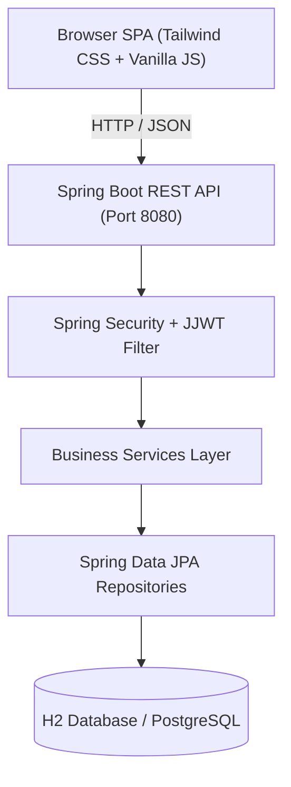
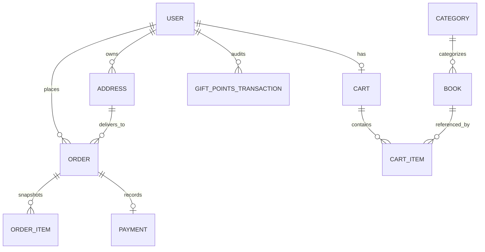

# 📚 Book Worm — Cloud Full-Stack E-Commerce Bookstore Platform

[](https://www.oracle.com/java/)
[](https://spring.io/projects/spring-boot)
[](https://spring.io/projects/spring-security)
[-success.svg?logo=junit5&logoColor=white)](src/test/java)
[](https://www.postgresql.org/)
[](src/main/resources/static)
[](src/main/resources/static/css/style.css)

> **AI Specialist & Cloud FullStack Capstone Project**  
> An enterprise-ready, cloud-native bookstore application delivering the complete 12-step customer journey from Slide 3 and wireframes from Slides 5–10 of the capstone instructions.

---

## 📑 Table of Contents

1. [Project Overview](#-project-overview)
2. [Visual Design System: Hydrangea Palette](#-visual-design-system-hydrangea-palette)
3. [Key Features & Customer Journeys](#-key-features--customer-journeys)
4. [System Architecture](#-system-architecture)
5. [Domain Model & Entities](#-domain-model--entities)
6. [REST API Specification](#-rest-api-specification)
7. [Testing & Quality Assurance](#-testing--quality-assurance)
8. [Quick Start & Setup Guide](#-quick-start--setup-guide)
9. [Pre-Seeded Demo Fixtures](#-pre-seeded-demo-fixtures)
10. [Repository Structure](#-repository-structure)

---

## 🌟 Project Overview

**Book Worm** is a full-featured online e-commerce platform where customers can explore, inspect, and purchase books across multiple categories and publisher brands. 

The application implements a responsive Single Page Application (SPA) frontend served by a Spring Boot 3.3.4 REST API backend. It features authentic 3D paperback cover representations (front and back with realistic ISBN-13 barcodes), a shopping cart with real-time arithmetic, multi-address delivery selection, 1:1 loyalty gift point redemption, idempotent payment simulation with rollback safety, and a one-click **Buy In Again** repurchase flow.

---

## 🎨 Visual Design System: Hydrangea Palette

The frontend is styled using **Tailwind CSS** following the **“Hydrangea” floral pastel minimalism** aesthetic with **sharp geometric edges**:

### Color Palette Reference

| Swatch | Color Name | Hex Code | Role in Application |
|---|---|---|---|
| ◽ | **Off-White Page** | `#FAF8F5` | Main document canvas providing warm, tactile readability |
| ⬛ | **Charcoal Text** | `#1E2024` / `#4A4F59` | High-contrast typography for headings and descriptions |
| 🍑 | **Soft Peach** | `#FFC2BA` / `#FFEAE6` | Section background panels (*Recommended*, *New Launches*, *Checkout Totals*) |
| 🌸 | **Rose Pink** | `#FF8DA1` | Promotional announcement banners and highlight tags |
| 🪻 | **Orchid Pink** | `#FF9CE9` | Category badges, *Top Picks* tags, and active filter pills |
| 💜 | **Bold Purple** | `#AD56C4` | Brand emblems, category active borders, focus rings, radio controls |
| 🟣 | **Deep Purple CTA** | `#74318A` | Primary action buttons (`Add to Basket`, `Pay Now`, `Explore Curations`) |
| ⬜ | **Neutral Card** | `#FFFFFF` | Crisp white containers ensuring 3D book covers pop prominently |

### Sharp Edge Rule
All UI elements—including buttons, cards, containers, modal windows, tags, inputs, and 3D book covers—strictly enforce **zero border radius** (`border-radius: 0 !important;` and Tailwind `borderRadius: 0px`).

---

## 🚀 Key Features & Customer Journeys


### 1. Catalogue & Filter Toolbar (Slides 5 & 6)
* **Categories:** Fiction, Non-Fiction, Science & Technology, Self-Help, History.
* **Filter Bar:** Debounced title/author search, Language selector (`English`, `Hindi`), Format dropdown (`Paperback`, `Hard Cover`, `eBook`), Publisher brand selector, and Sort selector (`Relevance`, `Price: Low to High`, `Price: High to Low`).
* **Dynamic Shelves:**
  * *Promotional Hero Banner:* Highlights seasonal curations in Rose Pink (`#FF8DA1`) & Soft Peach (`#FFC2BA`).
  * *Recommended for You:* Dynamic recommendations based on category purchase history.
  * *Bestsellers this Month:* Main catalogue grid with 3D book jackets.
  * *New Launches:* Fresh arrivals panel.

### 2. Product Details & Dual 3D Covers (Slide 7)
* **Dual 3D Book Cover:** Renders both **Front Cover** and **Back Cover** side-by-side with classical 2:3 portrait book proportions:
  * **Front Cover:** Bestseller tag, title, author, emblem, spine crease, and textured pattern.
  * **Back Cover:** Mirrored spine crease, quote in soft peach accent, blurb excerpt, author bio section, publisher colophon badge, and authentic white **ISBN-13 barcode sticker** (`ISBN 978-0-123456-78-9`).
* **Metadata & CTAs:** Live stock pill, delivery estimate (`Delivery by Mon, 21 Jul`), primary *Add to Basket* CTA, and *Related Reads* category shelf.

### 3. Shopping Cart & Address Selection (Slide 8)
* **Basket Items:** Quantity increment/decrement with stock boundary checks, line totals, and item removal.
* **Delivery Destination:** Toggle between saved user addresses or entering a custom shipping destination.
* **Loyalty Points Redemption:** Redeem gift points with real-time arithmetic ($1\text{ pt} = ₹1.00\text{ discount}$). Enforces $\text{Points} \le \min(\text{Balance}, \text{Subtotal})$.

### 4. Complete Payment Modal (Slide 9)
* **Method Tabs:** Vertical navigation tabs for *Credit Card*, *Debit Card*, *UPI*, and *Wallet*.
* **Evaluator Simulation Toggle:** Switch between `APPROVED` and `DECLINED` outcomes to verify transaction states, stock decrement, and point rollback mechanisms.
* **Security & Idempotency:** Strict `Idempotency-Key` enforcement preventing double billing on network retries. Raw card details and CVV are never stored or logged.

### 5. Purchase Confirmation & Order History (Slide 10)
* **Confirmation Screen:** Instant purchase modal with checkmark badge, thumbnail list of purchased reads, and navigation links.
* **Permanent Price Snapshots:** Orders snapshot unit prices and book titles at the moment of purchase; subsequent catalogue price adjustments never distort historical orders.
* **One-Click Buy Again:** Automatically re-adds available items from past purchases into the active cart at current prices.
* **48-Hour Order Cancellation:** Cancel eligible orders within 48 hours to restore stock and refund redeemed loyalty points.

---

## 🏗 System Architecture



* **Frontend:** HTML5, Tailwind CSS CDN (Hydrangea design system), Vanilla JavaScript (Modular MVC).
* **Backend:** Spring Boot 3.3.4, Java 17, Spring Security with stateless JWT filter.
* **Persistence:** Spring Data JPA with Hibernate ORM.
* **Database:** Default in-memory H2 database (zero installation needed); production-ready PostgreSQL profile.
* **Documentation:** Springdoc OpenAPI 3.0 with Swagger UI.

---

## 📊 Domain Model & Entities



### Entity Summary

* **User:** User account, email, encoded password, and gift points balance.
* **Category:** Hierarchical genre classifications.
* **Book:** Catalogue product with author, publisher, description, price, and available stock.
* **Cart & CartItem:** Active shopping session with item quantity constraints.
* **Address:** Shipping destination linked to user accounts.
* **Order & OrderItem:** Permanent purchase snapshot with status lifecycle:  
  `PENDING_PAYMENT` $\rightarrow$ `PAID` / `PAYMENT_FAILED` / `CANCELLED` / `SHIPPED`.
* **Payment:** Transaction record storing outcome status and unique transaction reference.
* **GiftPointsTransaction:** Audit trail tracking loyalty point redemptions and refunds.

---

## 🔌 REST API Specification

Base URL: `http://localhost:8080/api/v1`

| Domain | Method | Endpoint | Description |
|---|---|---|---|
| **Authentication** | `POST` | `/auth/login` | Authenticate with credentials; returns JWT token |
| **User Profile** | `GET` | `/me` | Fetch authenticated profile and gift points balance |
| **Catalogue** | `GET` | `/categories` | List all available categories |
| | `GET` | `/publishers` | List all unique book publishers / brands |
| | `GET` | `/books` | Paginated search, category, and publisher filtering |
| | `GET` | `/books/{id}` | Retrieve complete book details |
| | `GET` | `/books/{id}/related` | Fetch same-category related reads |
| **Shopping Cart** | `GET` | `/me/cart` | Retrieve current active cart with calculated subtotal |
| | `POST` | `/me/cart/items` | Add book to cart with stock validation |
| | `PUT` | `/me/cart/items/{bookId}`| Update quantity of an existing cart item |
| | `DELETE`| `/me/cart/items/{bookId}`| Remove book from cart |
| **Addresses** | `GET` | `/me/addresses` | List user's saved shipping addresses |
| | `POST` | `/me/addresses` | Add a new delivery address |
| **Checkout** | `POST` | `/me/checkout/quote` | Calculate quote with loyalty points discount |
| | `POST` | `/me/orders` | Place order (requires `Idempotency-Key` header) |
| **Payments** | `POST` | `/me/orders/{id}/pay` | Process simulated payment (requires `Idempotency-Key`) |
| **Order History** | `GET` | `/me/orders` | List customer orders (sorted newest first) |
| | `GET` | `/me/orders/{id}` | Retrieve order details and frozen price snapshots |
| | `POST` | `/me/orders/{id}/buy-again` | Re-add available books from past order into cart |
| | `POST` | `/me/orders/{id}/cancel` | Cancel order within 48 hours; restore stock & points |
| **Recommendations**| `GET` | `/me/recommendations` | Category-based recommendations from prior orders |

---

## 🧪 Testing & Quality Assurance

The codebase includes **55 automated tests** covering service business logic, integration flows, idempotency replays, and security constraints:

```
[INFO] Results:
[INFO] 
[INFO] Tests run: 55, Failures: 0, Errors: 0, Skipped: 0
[INFO] 
[INFO] ------------------------------------------------------------------------
[INFO] BUILD SUCCESS
[INFO] ------------------------------------------------------------------------
```

### Test Suite Breakdown

* **`BookstoreJourneyTest`:** Full end-to-end integration lifecycle test (Auth $\rightarrow$ Search $\rightarrow$ Cart $\rightarrow$ Quote $\rightarrow$ Idempotent Order $\rightarrow$ Payment $\rightarrow$ Snapshots $\rightarrow$ Buy Again).
* **`CatalogueServiceTest`:** Search filtering, publisher filtering, pagination, and related book retrieval.
* **`CartServiceTest`:** Arithmetic calculations, stock threshold rejection, and item removal.
* **`CheckoutServiceTest`:** Points boundary validation, empty cart rejection, and address ownership checks.
* **`PaymentServiceTest`:** `APPROVED` / `DECLINED` simulation, double deduction prevention, and idempotency key conflict handling.
* **`OrderServiceTest`:** Snapshot verification, Buy Again mechanics, 48-hour cancellation policy, and points restoration.
* **`AccountServiceTest`:** User profiles, address authorization, and cross-user data isolation.

---

## 💻 Quick Start & Setup Guide

### Prerequisites
* **Java 17** or higher (`java -version`)
* **Maven 3.8+** (or use included `mvnw`)

### 1. Clone the Repository
```bash
git clone https://github.com/heteshmohan-ibm/fda-repo.git
cd fda-repo
```

### 2. Run All Automated Tests
```powershell
cd ebookstore
mvn test
```

### 3. Launch the Application (In-Memory H2 DB)
```powershell
mvn spring-boot:run
```

Once launched, access the following in your web browser:
* **Web UI:** [http://localhost:8080/](http://localhost:8080/)
* **Swagger UI Documentation:** [http://localhost:8080/swagger-ui.html](http://localhost:8080/swagger-ui.html)
* **OpenAPI 3.0 JSON:** [http://localhost:8080/v3/api-docs](http://localhost:8080/v3/api-docs)

### 4. Run with PostgreSQL (Optional Production Mode)
To connect to a live PostgreSQL database:
```powershell
$env:SPRING_PROFILES_ACTIVE="postgres"
$env:DB_HOST="localhost"
$env:DB_PORT="5432"
$env:DB_NAME="ebookstoredb"
$env:DB_USERNAME="postgres"
$env:DB_PASSWORD="yourpassword"

mvn spring-boot:run
```

---

## 🔑 Pre-Seeded Demo Fixtures

On application startup, the database is automatically seeded with test data:

* **Demo User:** `demo@ebookstore.com`
* **Demo Password:** `demo1234`
* **Gift Points Balance:** `500` Points (₹500.00 purchasing credit)
* **Pre-Seeded Addresses:**
  1. `12 MG Road, Apt 4B, Bengaluru, Karnataka - 560001`
  2. `42 Anna Salai, Chennai, Tamil Nadu - 600002`
* **Featured Books:**
  * *The Joy of Minimalism* by Rachel Green (₹149.00) — Featured Slide 7 Title
  * *The Path to Success* by Michael Scott (₹359.00)
  * *The Art of Focus* by David Kim (₹399.00)
  * *Mastering Simplicity* by Elena Vance (₹199.00)
  * *Clean Code* by Robert C. Martin (₹649.00)
  * *Atomic Habits* by James Clear (₹449.00)
  * *Sapiens* by Yuval Noah Harari (₹499.00)
  * ...and 14 additional titles spanning all major genres.

---

## 📁 Repository Structure

```
fda-repo/
├── README.md                                  # Repository overview & quick start
├── E-Bookstore Step 1 Wireframe Analysis.md   # Architectural analysis & test matrix
├── e-bookstore-openapi (1).yaml              # OpenAPI 3.0 specification contract
└── ebookstore/                                # Spring Boot Application Root
    ├── pom.xml                                # Maven build & dependencies
    ├── README.md                              # Application documentation
    └── src/
        ├── main/
        │   ├── java/com/example/ebookstore/
        │   │   ├── config/                    # SecurityConfig, JwtUtil, DataSeeder
        │   │   ├── controller/                # REST Controllers (Catalogue, Cart, Orders, etc.)
        │   │   ├── dto/                       # Data Transfer Objects & DtoMapper
        │   │   ├── entity/                    # JPA Entities (Book, Order, Cart, User, etc.)
        │   │   ├── exception/                 # GlobalExceptionHandler & API Error DTOs
        │   │   ├── repository/                # Spring Data JPA Repositories
        │   │   └── service/                   # Business Services & Payment Simulation
        │   └── resources/
        │       ├── application.properties     # H2 & PostgreSQL configuration
        │       └── static/                    # Single Page Application
        │           ├── index.html             # Tailwind CSS Layout
        │           ├── css/style.css          # 3D Book Transforms & Sharp Edge Rules
        │           └── js/app.js              # State management & dynamic DOM rendering
        └── test/java/com/example/ebookstore/  # 55 Automated Integration & Unit Tests
```

---

## 📄 License & Attribution

Developed for the **AI Specialist - Cloud FullStack Capstone Assessment**.  
All rights reserved © 2026.
